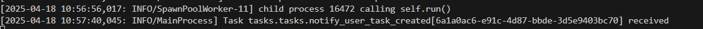

# Task Manager Backend (Django + DRF)

This is the backend for the Task Manager project built with Django and Django REST Framework (DRF). It handles authentication, task management, and background job processing.

## Features

- JWT-based authentication (registration, login, logout)
- Task model with title, description, status, due date
- CRUD operations restricted to task owners
- Custom permissions for task access control
- Celery + Redis for simulating email notification after task creation
- API documentation using swagger
- Basic unit tests for user and task operations

## Setup Instructions

1. Create virtual environment and install dependencies:

```bash
pip install -r requirements.txt
```

2. Setup Redis and run Celery worker:

```bash
celery -A taskmanager worker --loglevel=info
```

3. Apply migrations and run server:

```bash
python manage.py migrate
python manage.py runserver
```

4. Access documentation at:
 `/swagger`


## Project Structure

- `tasks/`: Task model, views, serializers, permissions
- `task_manager/`: Project settings and Celery config

## celery task


## Notes

Make sure Redis is running before starting Celery. Adjust CORS settings if accessing from a frontend hosted on another domain.